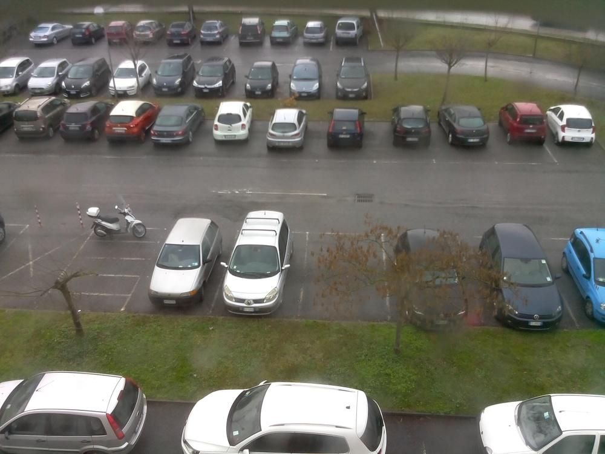
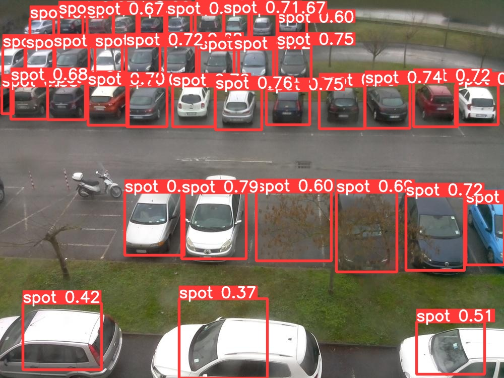
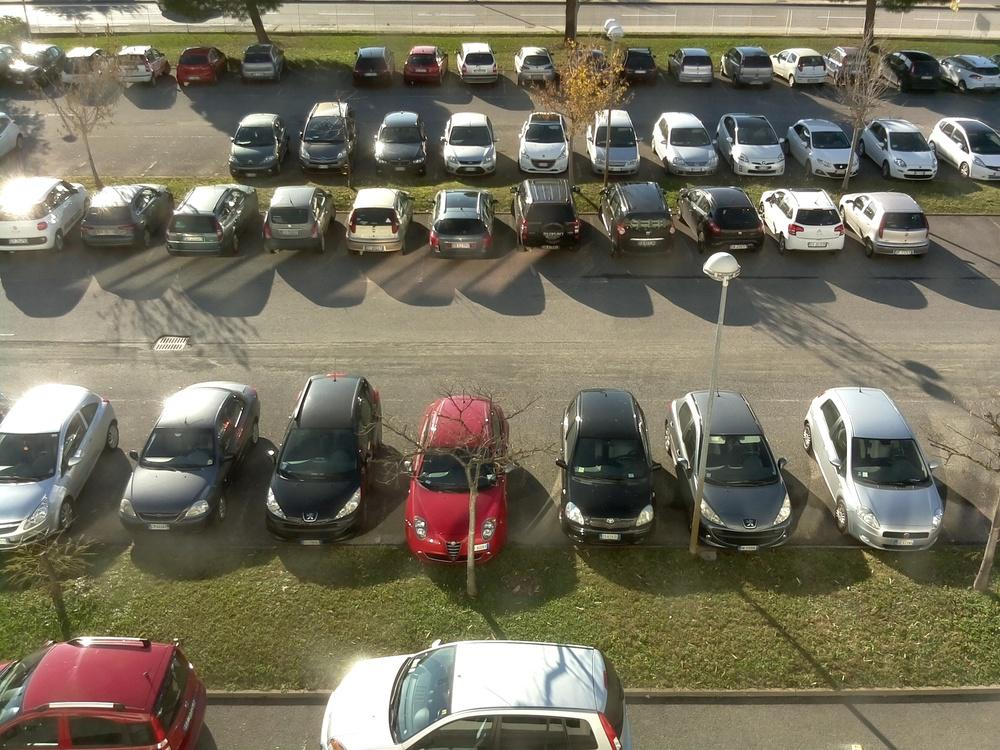
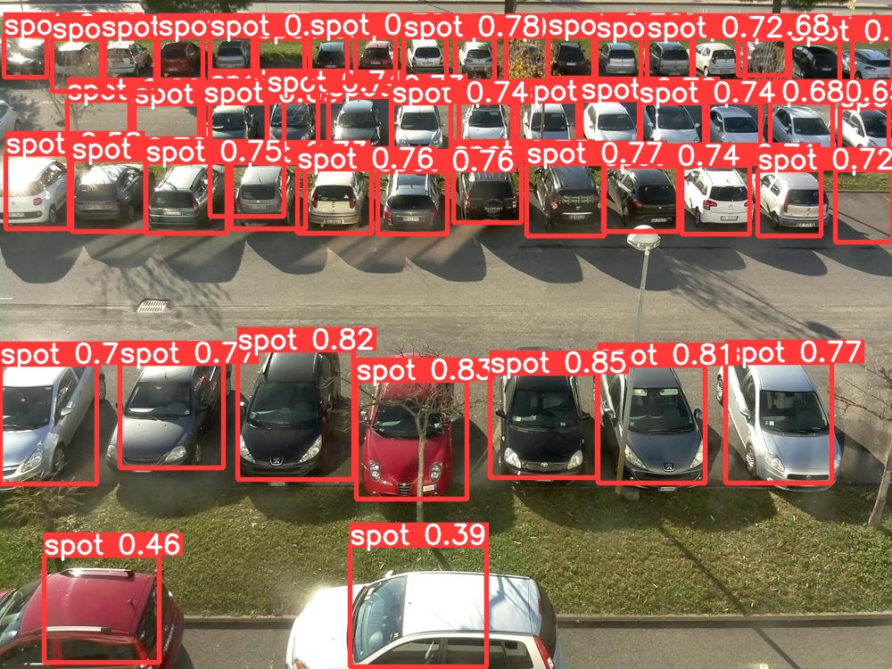
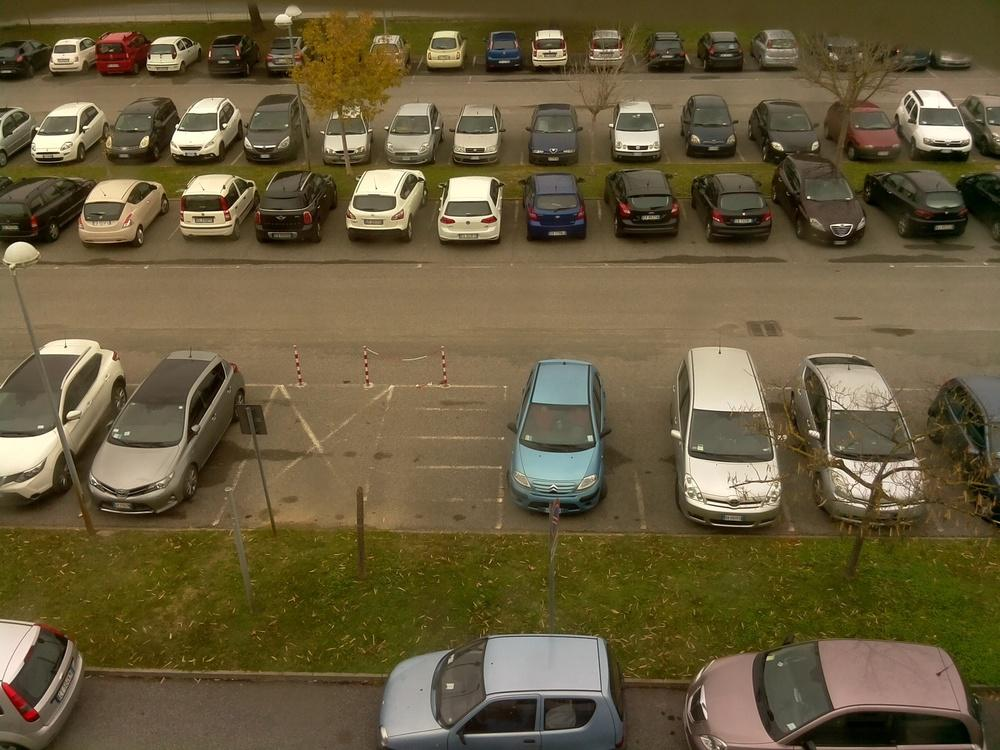
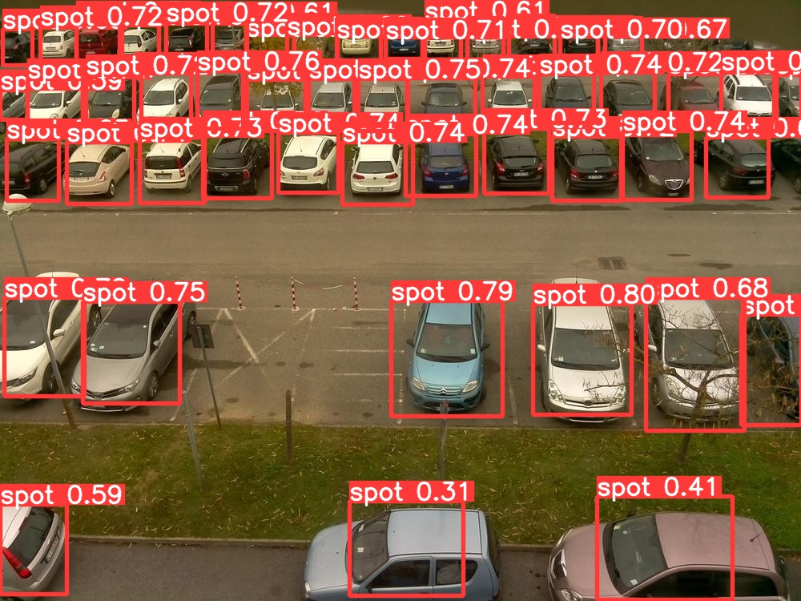

# parking-spots-detection
This is repository contains models trained on CNR-EXT dataset for parking spots detections.

## Setup:
1. Clone repository:
> `git clone https://github.com/blurry-mood/parking-spots-detection.git
cd parking-spots-detection`
2. Setup repository (this requires having a WandB account for visualization purposes):
> `./setup.sh`
3. Install CNR-EXT dataset:
> `./data/setup.sh`
4. Generate yolov5-compatible dataset:
> `./src/yolo/setup.sh`
5. Clone yolov5 repository:
> `git clone https://github.com/ultralytics/yolov5.git  
pip install -r yolov5/requirements.txt
`

## Use:
- To train a YOLOv5 model, use this command:
> `python yolov5/train.py --img 640 --batch 16 --epochs 3 --data src/yolo/yolo_data.yaml --cfg yolov5s.yaml`

- To detect parking spots from an image, use this command:
> `python yolov5/detect.py --source img.jpg --weights trained/yolov5s_640.pt --img 640 --iou-thres 0.33 --conf-thres 0.25  --max-det 200`  
The resutlts will be found in `yolov5/runs/detect`

- To convert model to ONNX, use this command:
> `python yolov5/export.py --weights trained/yolov5s_640.pt --img 640 --batch 1 --simplify --iou-thres 0.33 --conf-thres 0.25 --include onnx`
### **Note**:
- For more insights, check [train](https://github.com/ultralytics/yolov5/wiki/Train-Custom-Data), [export](https://github.com/ultralytics/yolov5/issues/251). 
- To train a new model, specifiy `src/yolo/yolo_data.yaml` as a value for this flag  ``--cfg``.

## Data Samples:
Raw image                  |  YOLOV5 predictions
:-------------------------:|:-------------------------:
 | 
 | 
 | 

## Model summary:
| Model | mAP@.5 | mAP@.5:.95 | GFLOPs |
| --- | --- | --- | --- |
| [YOLOv5s](trained/yolov5s_640.pt) | 0.854 | 0.388 | 16.3 |